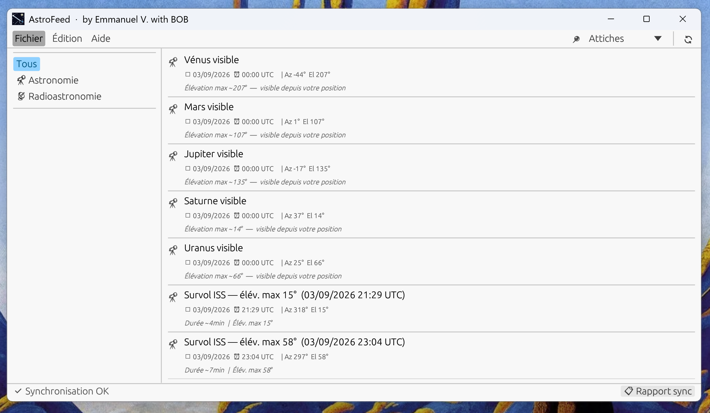
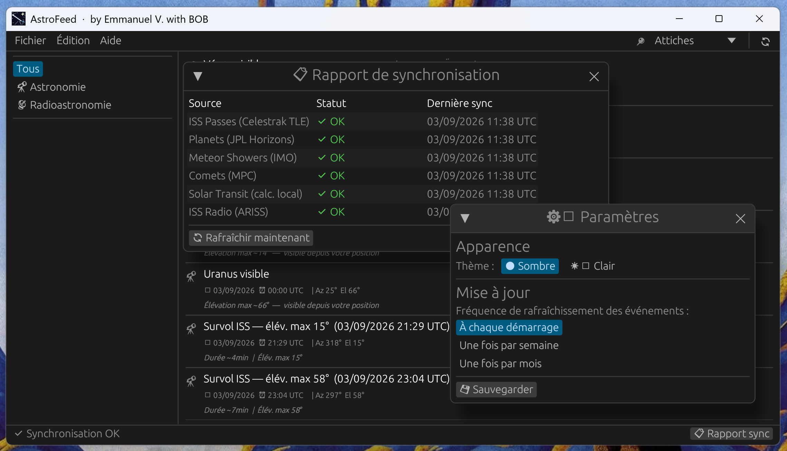

# AstroFeed

**Application de suivi des événements astronomiques et radioastronomiques**

> Écrite en Rust avec l'aide d'IBM Bob · Interface graphique egui/eframe · Linux & Windows





---

## Fonctionnalités

- 🔭 Suivi des **événements astronomiques** : survols ISS, planètes visibles, pluies de météores, comètes
- 📡 Suivi des **événements radioastronomiques** : contacts radio ARISS, transit solaire, comètes radio
- 📍 Gestion de **plusieurs positions** géographiques (nom, icône, lat/lon GPS ou manuelle)
- 🔄 Mise à jour automatique depuis des **sources publiques gratuites** (Open-Notify, JPL Horizons, ARISS…)
- 🌑 **Thème sombre** par défaut (idéal pour les sessions d'observation nocturne)
- 📋 Rapport de synchronisation des sources

## Prérequis

- Rust stable ≥ 1.75 ([installer rustup](https://rustup.rs))
- Linux : paquets `libgtk-3-dev`, `libxcb-*` (pour egui/eframe)
- Windows : Visual Studio Build Tools (MSVC)

## Compilation

```bash
# Debug
cargo build

# Release
cargo build --release
```

## Lancement

```bash
cargo run --release
```

## Structure du projet

```
src/
├── main.rs          # Point d'entrée
├── app.rs           # État global (AppState)
├── ui/              # Composants d'interface
├── model/           # Structures de données
├── sources/         # Connecteurs sources externes
├── config/          # Persistance configuration TOML
└── utils/           # Utilitaires (géo, calculs astronomiques)
```

## Spécification

Voir [SPEC.md](./SPEC.md) pour la spécification fonctionnelle et technique complète.

## Licence

MIT
